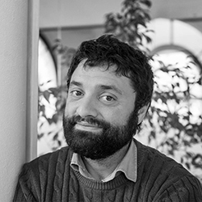

### LatinR2023 - Conferências

  Nesta sexta edição presencial, contaremos com a presença de quatro palestrantes proeminentes no campo da programação com R, com experiência tanto na academia quanto na indústria, comprometidos com a colaboração e a promoção da ciência, dados e software abertos.
  
 
 
 

#### _Dra. Hannah Frick_
Hannah Frick é co-fundadora do R Ladies Global e trabalha como engenheira de software na Posit (anteriormente RStudio) na área de modelagem estatística, colaborando no desenvolvimento do pacote tidymodels (um conjunto de pacotes para modelagem e aprendizado estatístico usando os princípios do pacote tidyverse) (https://www.frick.ws).
  

#### _Dra. Dianne Cook_
Dianne Cook é professora de Business Analytics na Universidade de Monash, cujos interesses de pesquisa incluem estatística computacional, visualização estatística, problemas em alta dimensão, entre outros. Ela é membro da Fundação R e atua como editora do R Journal (http://www.dicook.org).

  

#### _*Dr. Fabrizio Scrollini*_
Fabrizio Scrollini é o Diretor para a América Latina e o Caribe na Equipe Humanitária do OpenStreetMap (Equipo Humanitario de OpenStreetMap). Ele co-fundou a Iniciativa Latino-Americana por Dados Abertos (Iniciativa Latinoamericana por los Datos Abiertos - ILDA) e atualmente preside seu conselho. Ele explorou o uso de dados e aprendizado de máquina (IA) para desenvolvimento, transparência e inovação na América Latina, com foco especial no uso de dados para o bem público. Nesse papel, Fabrizio colaborou com a sociedade civil, governos e academia para desenvolver iniciativas e pesquisas relevantes para o contexto latino-americano. Ele é um dos consultores da Carta Internacional de Dados Abertos (Carta Internacional de los Datos Abiertos) e contribui ativamente para tópicos de governo aberto em nossa região.

  

#### _Dr. Max Kuhn_
Max Kuhn atualmente trabalha como engenheiro de software na Posit (anteriormente RStudio), liderando o desenvolvimento de software na área de modelagem estatística. Anteriormente, ele atuou como Diretor de Estatística Não Clínica na Pfizer Global. Ele é autor de inúmeros pacotes R com foco em aprendizado estatístico e pesquisa reprodutível (https://www.rstudio.com/authors/max-kuhn/).

